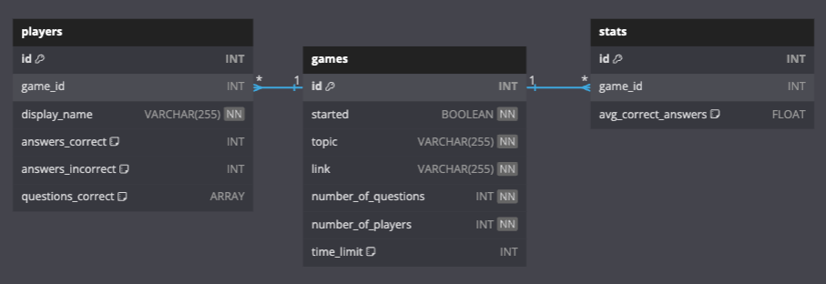

# <center>BrainFood</center>

## Table of Contents

- [Summary](#summary)
  - [Game Overview](#game-overview)
  - [Project Background](#project-background)
  - [Project Links](#project-links)
- [Schema](#schema)
- [Instructions](#instructions)
  - [Basic Setup](#basic-setup)
  - [Running a Local Server](#running-a-local-server)
  - [Testing](#testing)
- [Endpoints](#endpoints)
- [Contributors](#contributors)

## Summary
This API-only Rails app manages game, player, and stat data for Brain Defrost. Trivia questions for a game are received from an external API via a POST request to this [repository](https://github.com/Brain-Defrost/Brain-Defrost_BE-Questions). The questions are processed as plain old ruby objects (POROs), stored with Redis caching before being attached to a trivia game and sent to the frontend, and available through all game endpoints. Multiplayer funcionality was implemented using ActionCable for WebSockets.

### Game Overview
Brain Defrost is a web application designed to help people become more connected and engaged virtually via a trivia game. Generative AI is used to create custom trivia questions based on the topic and desired question count provided.

To play, a user inputs a topic, number of questions, number of players, a time limit to answer questions, and what they'd like their display name to be. The user is then taken to the game's lobby and provided with a shareable link other players may use to join. Once everyone joins, players may start the game and enjoy answering trivia questions. The correct answer and a list of players who answered correctly is displayed after each question. At the end, players may request the game's final stats via email.

### Project Background

This project was completed for Turing's Capstone Project for Mod 4. [Part 1](https://mod4.turing.edu/projects/capstone/) of the project pertained planning and completing our app's minimum viable product (MVP). [Part 2](https://mod4.turing.edu/projects/capstone_expansion/) focused on adding additional features: caching a game's questions with Redis, implementing multiplayer with WebSockets, and allowing users to receive an email of the game results using Sidekiq for the background job.

### Project Links
|Repo|Deployment|Description|
|:--:|:--:|:--:|
|[FE Repo](https://github.com/Brain-Defrost/Brain-Defrost_FE)|[FE Netlify](https://brain-defrost.netlify.app/)| Play a game of trivia|
|[BE Repo 1](https://github.com/Brain-Defrost/Brain-Defrost_BE)  (you're here) | [BE Heroku](https://brain-defrost-f8afea5ead0a.herokuapp.com/)| Game, player, stats API|
|[BE Repo 2](https://github.com/Brain-Defrost/Brain-Defrost_BE-Questions)|[BE Render](https://brain-defrost-be-questions.onrender.com/)|Questions API|

## Schema



## Instructions
### Basic Setup
1. Fork and/or clone this repo from GitHub
2. In terminal, run `git clone <ssh or https path>`
3. Navigate into the cloned project by running `cd Brain-Defrost_BE`
4. Run `bundle install` to install gems used for this project
5. Setup the database by running `rails db:{drop,create,migrate}`

### Running a Local Server

This app uses `http://localhost:3000`.

To start the local server run `rails server` in the terminal while in the app's base directory (Brain-Defrost_BE-Questions folder).

To stop the local rails server use `Ctrl` + `C` in the open terminal.


### Testing
[Rspec](https://rspec.info/documentation/) was used for testing. This project currently uses rspec-rails v6.1 and rspec-core v3.13.

**Terminal commands**<br>
<details>
<summary>To run the entire test suite</summary>

```shell
bundle exec rspec spec
```
</details>

<details>
<summary>To run a test folder</summary>

```shell
bundle exec rspec spec/folder_name
# ex: bundle exec rspec spec/models
```
</details>

<details>
<summary>To run just one file</summary>

```shell
bundle exec rspec <path/to/test/file>
# ex: bundle exec rspec spec/requests/api/v1/games_spec.rb
```
</details>

<details>
<summary>To run just one test</summary>

```shell
bundle exec rspec <path/to/test/file>:test_line
# ex: bundle exec spec/requests/api/v1/players_spec.rb:76
```
</details>


## Endpoints

API documentation may be accessed [here](https://brain-defrost-f8afea5ead0a.herokuapp.com/api-docs/index.html). Documentation was setup using the [rswag gem](https://github.com/rswag/rswag?tab=readme-ov-file) and [SwaggerUI](https://swagger.io/tools/swagger-ui/). 

To access the API documentation on the local server. [Start](#local-server) the server and navigate to `http://localhost:3000/api-docs/index.html` in a browser.

If preferred, you can also use [Postman](https://www.postman.com/) to run endpoints, but you will still need to startup the local server using the `rails server` command.

## Contributors
#### Backend Team
Martin Chavez - [Github](https://github.com/laurarvegav) | [LinkedIn](https://www.linkedin.com/in/laurarvegav/)<br>
Jessica Kohl - [Github](https://github.com/kohljd) | [LinkedIn](https://www.linkedin.com/in/jessica-kohl-545785113/) <br>
Laura Vega - [Github](https://github.com/laurarvegav) | [LinkedIn](https://www.linkedin.com/in/laurarvegav/)

#### Frontend Team
Ethan Duvall - [Github](https://github.com/EthanDuvall) | [LinkedIn](https://www.linkedin.com/in/eaduvall/)<br>
Tayla Phillips - [Github](https://github.com/tednaphil) | [LinkedIn](https://www.linkedin.com/in/taylarichardsphillips/)
